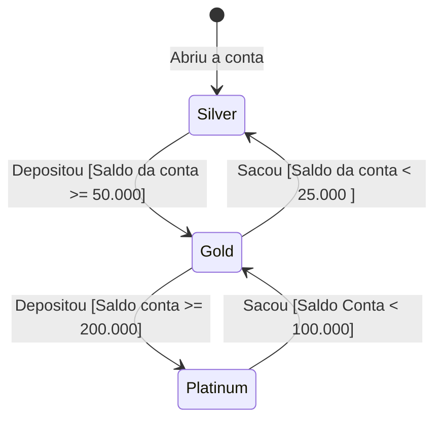

## Exercicio de Teste da Conta Magica.

---

### Especificação:

Foi dado o seguinte enunciado aos alunos:
Seja a seguinte descrição de um sistema bancário: um banco possui um produto diferenciado chamada “conta mágica”. Nesta
conta, quanto mais dinheiro o cliente tem depositado mais o banco valoriza seus depósitos. Todos as contas iniciam na
categoria “Silver” e zeradas. Contas “Silver” não têm seus depósitos valorizados, ou seja, o valor creditado é
exatamente o valor depositado pelo cliente. Quando o saldo da conta atinge ou ultrapassa R$ 50.000,00, a conta passa
para a categoria “Gold”. Contas “Gold” têm seus depósitos valorizados em 1%. Neste caso se o cliente depositar R$
1.000,00 o valor creditado será de R$ 1.010,00. Finalmente se o saldo da conta atinge ou supera os R$ 200.000,00, a
conta passa para a categoria “Platinum”. Contas “Platinum” têm seus depósitos valorizados em 2,5%. A verificação de
“upgrade” da conta se dá via operação de depósito, e não é possível que um cliente faça “upgrade” diretamente de
“Silver” para “Platinum” em uma única operação.

Quando o saldo da conta diminui, em função de uma operação de retirada/saque, a categoria também pode retroceder. Os
limites, porém, não são os mesmos que os verificados quando uma conta sofre “upgrade”. Uma conta só perde sua categoria
“Platinum”, e passa para “Gold”, se o saldo cair abaixo de R$ 100.000,00. A conta só perde a categoria “Gold”, e passa
para “Silver”, se o saldo cair para menos de R$ 25.000,00. Note que uma conta nunca perde duas categorias em uma única
operação de retirada mesmo que o saldo caia abaixo de R$ 25.000,00. Se ele era “Platinum”, cai para “Gold”. Só poderá
cair para “Silver” na próxima operação de retirada. Observação: as contas nunca podem ficar negativas.

O esqueleto da classe “ContaCorrente” está definido na sequência. Considere que o número da conta e o nome do
correntista são informados pelo construtor e o saldo inicial é sempre zero. Os métodos de depósito e retirada retornam
“false” quando alguma coisa não permitir a operação (valor inválido, saldo insuficiente etc.).

O número da conta é um valor inteiro positivo pertencente ao intervalo (99999;999999] seguido de um traço seguido de
dois dígitos correspondentes ao somatório dos dígitos do número da conta. Exemplos: 100445-14, 344122-16. Para valores
inválidos o construtor deve gerar uma IllegalNumberException.

O nome do cliente tem de ter pelo menos 3 caracteres que correspondam a letras. Caso o nome não atenda a esta regra o
construtor deve gerar uma IllegalNameException.

---

### Diagrama de estado.

Com isso, foi solicidao aos alunos que fosse feito o diagrama de estado da execução da conta,\
Sendo possivel representar os estados durante a execução do código.

Diagrama de Estado

---

### Particionamento e limites.

#### Particionamento:

---

Após a criação da diagrama de estados foi possivel realizar a criação das seguintes partições:

- Criação de conta com Nome inválido.
- Criação de conta com o número inválido
- Criação de conta válida.
- Saque jamais pode deixar a conta negativa.
- Em conta Silver.
    - Deposito de valor menor de 50.000 deve permanecer em estado Silver
    - Quando saldo maior ou igual a 50.000 deve trocar para estado GOLD.
    - Qualquer deposito deve render 0%.
    - Saldos maiores que 200.000 devem trocar para estado Gold.
- Em conta Gold.
    - Qualquer depoisto deve render 1%
    - Saldo menor que 25.000 deve trocar estado para Silver
    - Quando saldo maior ou igual a 200.000 deve trocar para estado Platinum
- Em conta Platinum.
    - Qualque deposito deve render 2.5%.
    - Quando saldo menor que 100.000 deve trocar para Silver.
    - Quando Retirada que torne o saldo menor que 25.000 Ainda deve ser estado Silver.

#### Limites:

---

Com a formulação das partições foi possivel realizar a criação dos valores limites.

Limites para operações com Saque e Deposito

| Categoria | Saldo   | Deposito | Saque   | 
|-----------|---------|----------|---------| 
| SILVER    | 0       | 1.000    | 0       |
| SILVER    | 0       | 50.000   | 0       |
| SILVER    | 0       | 250.000  | 0       |
| SILVER    | 0       | 0        | 10      |
| GOLD      | 50.000  | 0        | 25.001  |
| GOLD      | 50.000  | 1000     | 25.001  |
| GOLD      | 50.000  | 0        | 50.001  |
| GOLD      | 50.000  | 150000   | 0       |
| PLATINUM  | 200.000 | 1000     | 0       |
| PLATINUM  | 200.000 | 0        | 100.001 |
| PLATINUM  | 200.000 | 0        | 200.001 |
| PLATINUM  | 200.000 | 0        | 175.001 |

Limites para Criação da conta

| Nome          | Numero       |
|---------------|--------------|
| "NOME_VALIDO" | "0"          |
| "NOME_VALIDO" | "99999"      |
| "NOME_VALIDO" | "99999-45"   |
| "NOME_VALIDO" | "100000-01"  |
| "NOME_VALIDO" | "999999-36"  |
| "NOME_VALIDO" | "999999-54"  |
| "NOME_VALIDO" | "999999 -54" |
| "NOME_VALIDO" | "1000000-01" |
| "NOM"         | "123456-21"  |

---

### Ajustes da classe principal.

