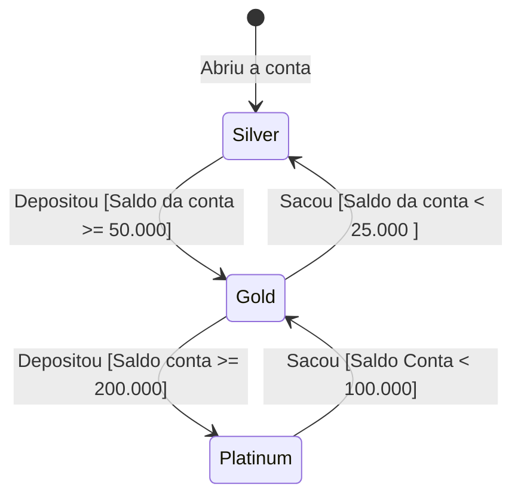

## Exercicio de Teste da Conta Magica.

---

### Especificação:

Foi dado o seguinte enunciado aos alunos:
Seja a seguinte descrição de um sistema bancário: um banco possui um produto diferenciado chamada “conta mágica”. Nesta
conta, quanto mais dinheiro o cliente tem depositado mais o banco valoriza seus depósitos. Todos as contas iniciam na
categoria “Silver” e zeradas. Contas “Silver” não têm seus depósitos valorizados, ou seja, o valor creditado é
exatamente o valor depositado pelo cliente. Quando o saldo da conta atinge ou ultrapassa R$ 50.000,00, a conta passa
para a categoria “Gold”. Contas “Gold” têm seus depósitos valorizados em 1%. Neste caso se o cliente depositar R$
1.000,00 o valor creditado será de R$ 1.010,00. Finalmente se o saldo da conta atinge ou supera os R$ 200.000,00, a
conta passa para a categoria “Platinum”. Contas “Platinum” têm seus depósitos valorizados em 2,5%. A verificação de
“upgrade” da conta se dá via operação de depósito, e não é possível que um cliente faça “upgrade” diretamente de
“Silver” para “Platinum” em uma única operação.

Quando o saldo da conta diminui, em função de uma operação de retirada/saque, a categoria também pode retroceder. Os
limites, porém, não são os mesmos que os verificados quando uma conta sofre “upgrade”. Uma conta só perde sua categoria
“Platinum”, e passa para “Gold”, se o saldo cair abaixo de R$ 100.000,00. A conta só perde a categoria “Gold”, e passa
para “Silver”, se o saldo cair para menos de R$ 25.000,00. Note que uma conta nunca perde duas categorias em uma única
operação de retirada mesmo que o saldo caia abaixo de R$ 25.000,00. Se ele era “Platinum”, cai para “Gold”. Só poderá
cair para “Silver” na próxima operação de retirada. Observação: as contas nunca podem ficar negativas.

O esqueleto da classe “ContaCorrente” está definido na sequência. Considere que o número da conta e o nome do
correntista são informados pelo construtor e o saldo inicial é sempre zero. Os métodos de depósito e retirada retornam
“false” quando alguma coisa não permitir a operação (valor inválido, saldo insuficiente etc.).

O número da conta é um valor inteiro positivo pertencente ao intervalo (99999;999999] seguido de um traço seguido de
dois dígitos correspondentes ao somatório dos dígitos do número da conta. Exemplos: 100445-14, 344122-16. Para valores
inválidos o construtor deve gerar uma IllegalNumberException.

O nome do cliente tem de ter pelo menos 3 caracteres que correspondam a letras. Caso o nome não atenda a esta regra o
construtor deve gerar uma IllegalNameException.

---

### Diagrama de estado.

Com isso, foi solicidao aos alunos que fosse feito o diagrama de estado da execução da conta,\
Sendo possivel representar os estados durante a execução do código.

Diagrama de Estado

---

### Particionamento e limites.

#### Particionamento:

---

Após a criação da diagrama de estados foi possivel realizar a criação das seguintes partições:

- Criação de conta com Nome inválido.
- Criação de conta com o número inválido
- Criação de conta válida.
- Saque jamais pode deixar a conta negativa.
- Em conta Silver.
    - Deposito de valor menor de 50.000 deve permanecer em estado Silver
    - Quando saldo maior ou igual a 50.000 deve trocar para estado GOLD.
    - Qualquer deposito deve render 0%.
    - Saldos maiores que 200.000 devem trocar para estado Gold.
- Em conta Gold.
    - Qualquer depoisto deve render 1%
    - Saldo menor que 25.000 deve trocar estado para Silver
    - Quando saldo maior ou igual a 200.000 deve trocar para estado Platinum
- Em conta Platinum.
    - Qualque deposito deve render 2.5%.
    - Quando saldo menor que 100.000 deve trocar para Silver.
    - Quando Retirada que torne o saldo menor que 25.000 Ainda deve ser estado Silver.

#### Limites:

---

Com a formulação das partições foi possivel realizar a criação dos valores limites.

Limites para operações com Saque e Deposito

| Categoria | Saldo   | Deposito | Saque   | 
|-----------|---------|----------|---------| 
| SILVER    | 0       | 1.000    | 0       |
| SILVER    | 0       | 50.000   | 0       |
| SILVER    | 0       | 200.000  | 0       |
| SILVER    | 0       | 0        | 10      |
| SILVER    | 1000    | 0        | 500     |
| SILVER    | 1000    | 0        | 1000    |
| GOLD      | 50.000  | 0        | 25.001  |
| GOLD      | 50.000  | 0        | 25.000  |
| GOLD      | 50.000  | 1000     | 0       |
| GOLD      | 50.000  | 0        | 50.001  |
| GOLD      | 50.000  | 0        | 50.000  |
| GOLD      | 50.000  | 150000   | 0       |
| PLATINUM  | 200.000 | 1000     | 0       |
| PLATINUM  | 200.000 | 0        | 100.000 |
| PLATINUM  | 200.000 | 0        | 100.001 |
| PLATINUM  | 200.000 | 0        | 200.001 |
| PLATINUM  | 200.000 | 0        | 200.000 |

Limites para Criação da conta

| Nome          | Numero       |
|---------------|--------------|
| "NOME_VALIDO" | "0"          |
| "NOME_VALIDO" | "99999"      |
| "NOME_VALIDO" | "999999-36"  |
| "NOME_VALIDO" | "999999-54"  |
| "NOME_VALIDO" | "1000000-01" |
| "NO"          | "123456-21"  |

---

### Ajustes da classe principal.

Ao executar os testes para a criação da conta,
Quando foi criada uma conta que possuia um número que não possuia "-" (traço)
Foi apresentando um erro de logica.
ao modificar o método ***verificaNome()*** para que validasse a existencia do traço
e tamanho da string foi possível passar pelos testes de erro ao criar conta com erro no número.

Ao realizar o teste para o deposito de 50.000 na conta Silver com o intuito de realizar
o upgrade para GOLD, foi possivel ver que não foi aplicado o valor de 1% de rendimento
nem a conta foi atualizada para GOLD.
olhando o código, foi possivel ver que ao realizar o deposito, ele apenas verificava o valor
atual de saldo, e ignorava o novo valor, além disso, não era aplicado o rendimento junto ao deposito.

Ao tentar executar o saque de um valor negativo, foi obtido um valor errado de acordo com as regras de negocio
apresentadas.
Analisando o código foi possivel encontrar a seguinte linha de código no método retirada:
`if (valor <= 0.0) { return true; }`. Com isso, era possivel realizar a retirada de valores negativos.
Ajustando para `if (valor <= 0.0) { return false; }` foi possivel garantir o comportamento.

Ao realizar um saque qualquer em uma conta, foi possivel notar que o retorno padrão de uma operação correta,
estava sendo retornado o valor false ao invés de true.
arrumando os ramos para devolver o valor true, conseguimos garantir o comportamento correto.

Ao realizar o saque em conta gold, foi possivel notar que exisita alguma logica sendo aplicada ao valor a ser retirado.
O saque, de não deve haver modificação no valor, portanto, ao realizar esse ajuste, 
foi possivel garantir o comportamento correto.
Assim como foi possível notar que ao realizar o saldo no valor limite de 25000, este era reduzido a Silver
de forma erronea.
Analisando o código foi possível ver que as regras de limite estava invertidas.
Da mesma forma ocorreu para as regras de Platinum.

Ao realizar o deposito em uma conta gold, sem que haja o upgrade, o valor aplicado de rendimento
estava sendo aplicado incorretamente.
Ao invés de aplicar o valor de entrada mais 1% estava sendo aplicado somente 1% do valor de entrada

Da mesma forma apresentada no Deposito, as validações não estavam levando em conta o valor ao ser retirada para saber
se havia a necessidade de realizar o downgrade.
por exemplo foi modificado `if (saldo < 25000)` para `if(saldo - valor < 25000)`
assim sempre validando na entrada se existe o downgrade. 
Além disso também foi notado que ao realizar o downgrade de Gold para Silver.
O valor estava sendo aumentado ao saldo ao invés de diminuido.

Ao tentar retirar, em uma conta Gold, um valor que deixasse o saldo negativo, o resultado foi informado como possível.
Analisando o código, foi possivel notar que na regra de retirada, a validação para saldo negativo era exclusiva a
categoria Silver, realizando o ajuste da seguinte forma
Ajustado o if de `if(categoria == Categoria.SILVER && saldo - valor > 0)` para
`if(saldo - valor >= 0)` e adicionando as regras de downgrade.
Foi tambem ajustando para validar se o novoSaldo será negativo antes das outras validações

Ao realizar o upgrade de GOLD para PLATINUM não estava sendo aplicado o rendimento correto.
Assim como ao realizar o deposito em conta PLATINUM.